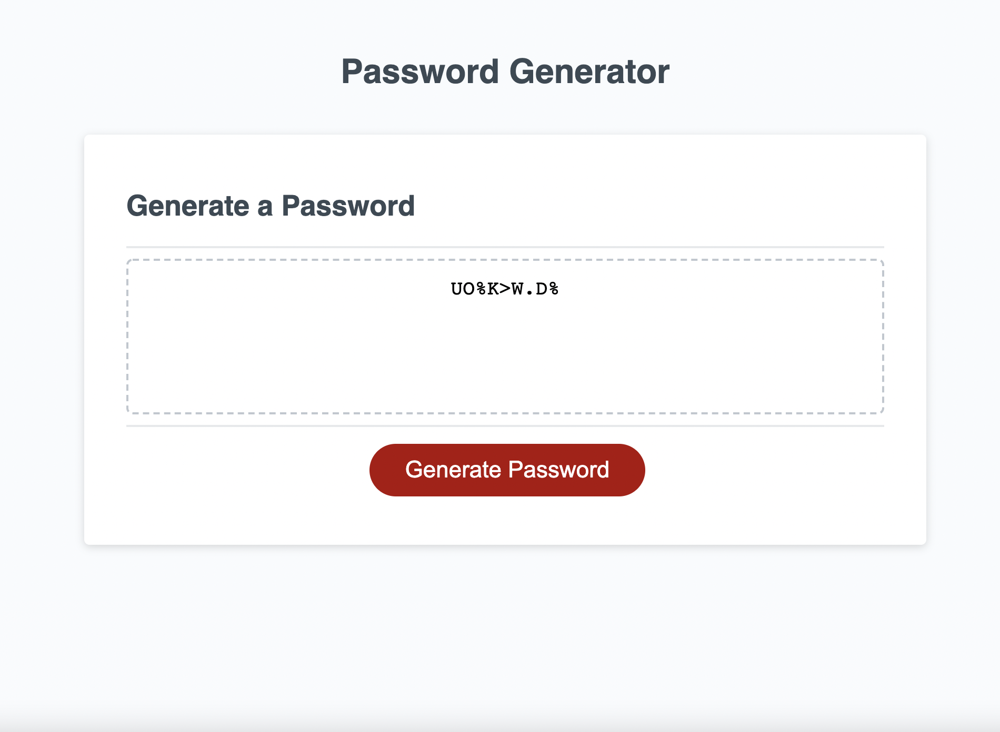

# Random Password Generator

## Description

An insecure random password generator made of vanilla JavaScript.

## License
    

## Installation

Clone it or download a zip file of it. 

## Usage

Use my password generator [here](https://rawagschal.github.io/pw-generator/)

## Credits

Stackoverflow, W3Schools, and [the homie who wrote the starter code](https://github.com/Xandromus), as always.

## Contributions

Fork it or open an issue on the original repo.

## Contact

Questions, comments, or conerns? Find me on [GitHub](https://github.com/rawagschal/) or [send me an email](mailto:rawagschal@gmail.com).
